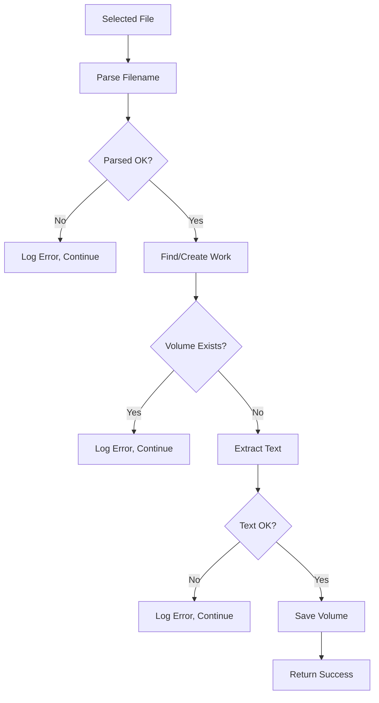

# Design: Add-to-Database Command Enhancement

## Overview

Enhanced the `add-to-database` CLI command to automatically extract text from selected PDF/EPUB files and add them to the database, parsing book title and volume number from filenames.

## Filename Format

**Pattern**: `"Título del Libro - Volumen X.ext"`

**Examples**:
- `El Señor de los Anillos - Volumen 1.pdf` → title: "El Señor de los Anillos", volume: 1
- `Dune - Volumen 2.epub` → title: "Dune", volume: 2

**Regex**: `r"^(.+?)\s*-\s*Volumen\s+(\d+)$"`

## Architecture

```
add_to_database.py
├── parse_filename()              # Extract title and volume from filename
├── get_book_repository()         # Initialize BookRepository with config
├── find_or_create_work()         # Get existing Work or create new
├── process_single_file()         # Process one file with full flow
├── process_files()               # Iterate over files with progress
├── print_results()               # Display summary with status
└── add_to_database()             # CLI entry point
```

## Flow



## Data Structures

### ParsedFilename
```python
@dataclass
class ParsedFilename:
    title: str
    volume_number: int
```

### ProcessingResult
```python
@dataclass
class ProcessingResult:
    filename: str
    success: bool
    work_title: Optional[str]
    volume_number: Optional[int]
    work_created: bool
    error_message: Optional[str]
```

## Error Handling

| Scenario | Action |
|----------|--------|
| Filename parse fails | Log warning, continue to next file |
| Work lookup fails | Log error, continue |
| Volume already exists | Log warning, skip file |
| Text extraction fails | Log error, continue |
| Database error | Log error, continue |

Final summary shows all successes and failures.

## Output Example

```
✓ Archivos procesados exitosamente:
  ✓ 'Dune - Volumen 1.pdf' → Work creado, Volumen 1
  ✓ 'Dune - Volumen 2.pdf' → Work existente, Volumen 2

✗ Archivos con errores:
  ✗ 'archivo_sin_formato.pdf' → No se pudo parsear el nombre...

Resumen: 2 exitoso(s), 1 fallido(s)
```

## Components Used

- **TextExtractor**: Extracts and cleans text from PDF/EPUB
- **BookRepository**: Manages Work and Volume in PostgreSQL
- **GlobalConfig**: Database connection settings
- **Rich Progress**: Progress bar during processing

## Future Enhancements

1. Support for alternative filename patterns
2. Interactive title correction when parse fails
3. Batch processing with parallel execution
4. Duplicate detection with similarity matching
